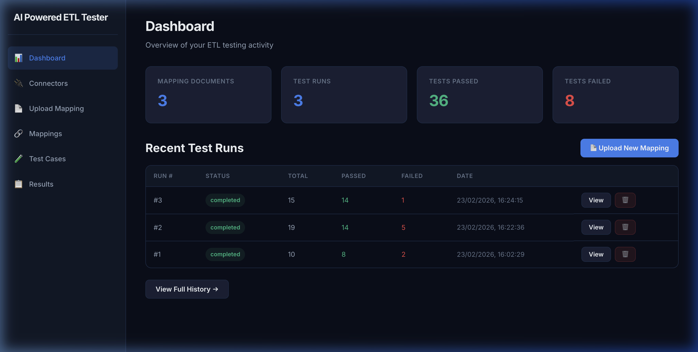
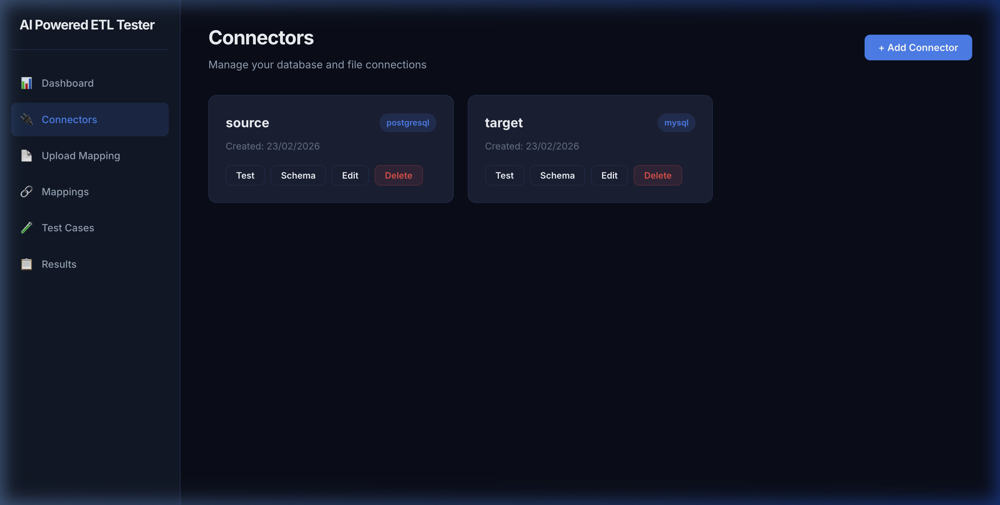
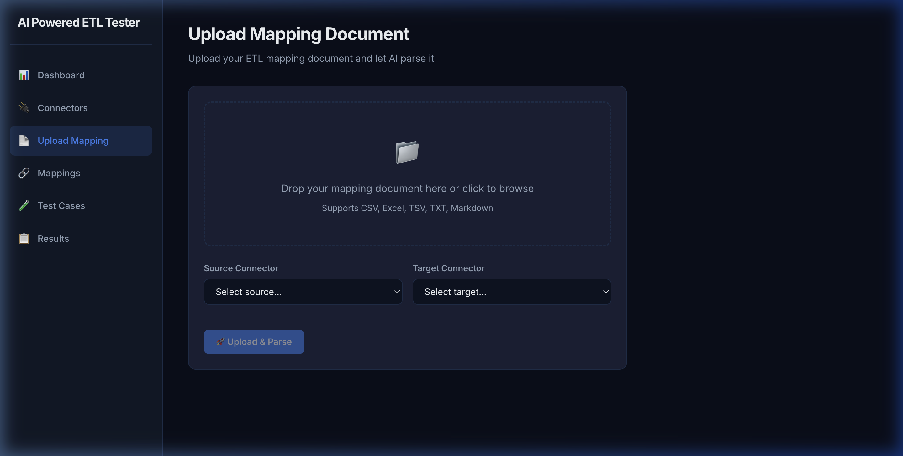
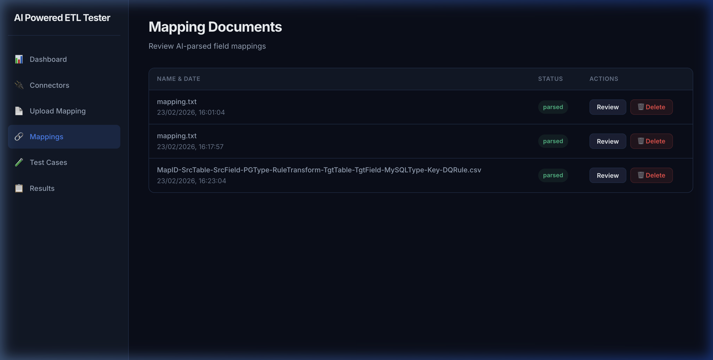
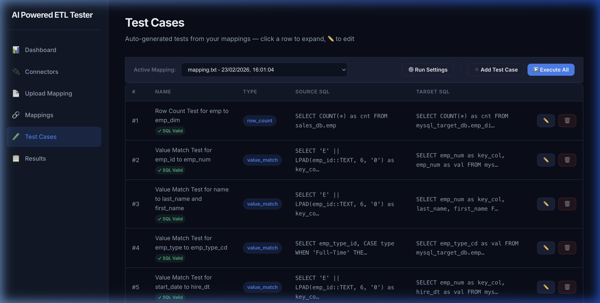

# AI-ETL-Tester

[](https://www.docker.com/)
[](https://reactjs.org/)
[](https://fastapi.tiangolo.com/)

A modern, high-performance SaaS platform designed to automate and streamline ETL (Extract, Transform, Load) testing using AI.



---

## 🚀 Key Features

### 📊 Comprehensive Dashboard
Get a bird's-eye view of your ETL testing activity, including mapping document counts, test run history, and pass/fail metrics.

### 🔌 Multi-Source Connectors
Connect to various data sources including PostgreSQL, MySQL, MSSQL, and file-based data (CSV, Excel, Parquet).
> [!TIP]
> **Highly Extensible**: The connector architecture is designed for easy expansion. You can extend it to support any SQL dialect (Oracle, Snowflake, BigQuery) or NoSQL databases (MongoDB, Cassandra) at any time.


### 🧠 AI Mapping Analysis
Upload mapping documents and let AI automatically identify field mappings and transformation rules. Support for CSV, Excel, Markdown, and TXT files.


### 🧪 Automated Test Generation
One-click generation of validated SQL test cases for row counts, null checks, uniqueness, and value transformations.


### 📝 Test Case Management
Review, edit, and manage generated test cases with integrated SQL validation tracking.


---

## 🛠 Tech Stack

- **Frontend**: React, Vite, Axios (with custom 5m timeouts for AI tasks).
- **Backend**: FastAPI, SQLAlchemy, DuckDB (for file processing).
- **AI**: LiteLLM (Provider-agnostic: OpenAI, Anthropic, Ollama).
- **Infrastructure**: Docker, Nginx (optimized reverse proxy).

---

## 🚦 Getting Started

### Prerequisites
- [Docker Desktop](https://www.docker.com/products/docker-desktop/)
- AI API Key (OpenAI/Anthropic)

### Installation

1. **Clone & Setup**:
   ```bash
   git clone <repo-url>
   cd ai-etl-tester
   ```

2. **Environment**:
   Create a `.env` in the root (see [.env.example](.env.example)):
   ```env
   # Database
   DB_USER=etl_user
   DB_PASSWORD=etl_pass
   DB_NAME=etl_testing

   # AI
   AI_PROVIDER=openai
   AI_MODEL=gpt-4o
   AI_API_KEY=your_key
   ```

3. **Deploy**:
   ```bash
   docker compose up -d --build
   ```

4. **Access**:
   - Web UI: [http://localhost](http://localhost)
   - API Docs: [http://localhost:8000/docs](http://localhost:8000/docs)

---

## 📂 Project Structure

```text
.
├── backend/            # Python FastAPI backend
├── frontend/           # React frontend
├── docs/               # Documentation & Screenshots
├── docker-compose.yml  # Container orchestration
└── .gitignore          # Root-level ignore rules
```
